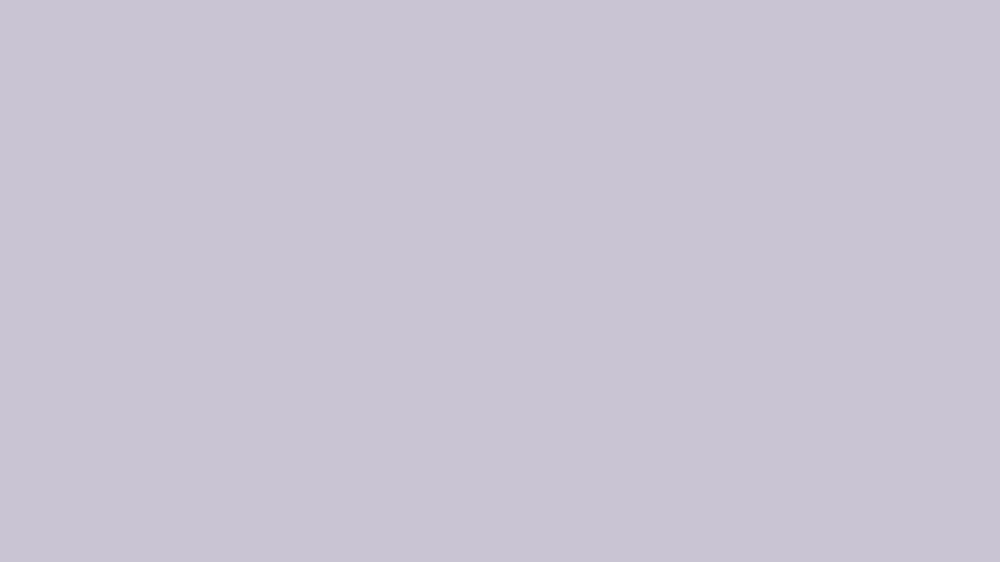
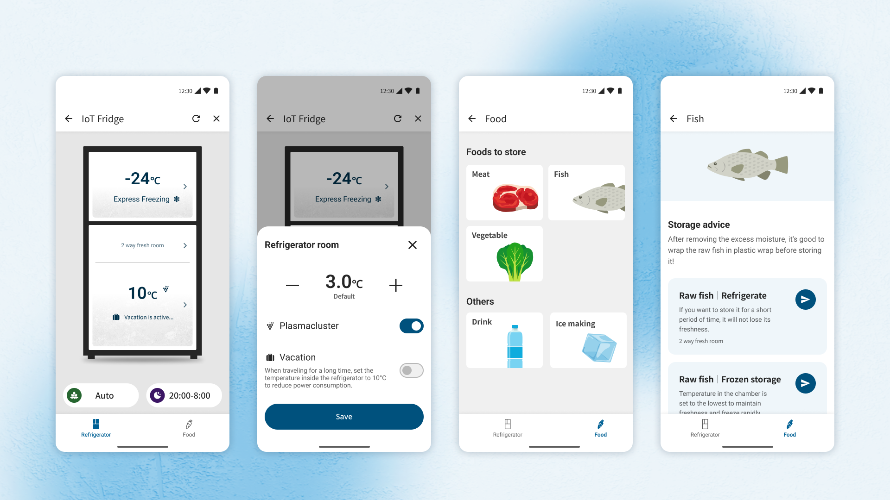
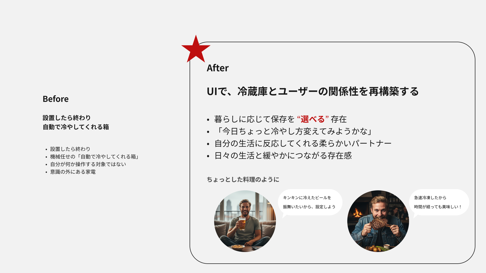
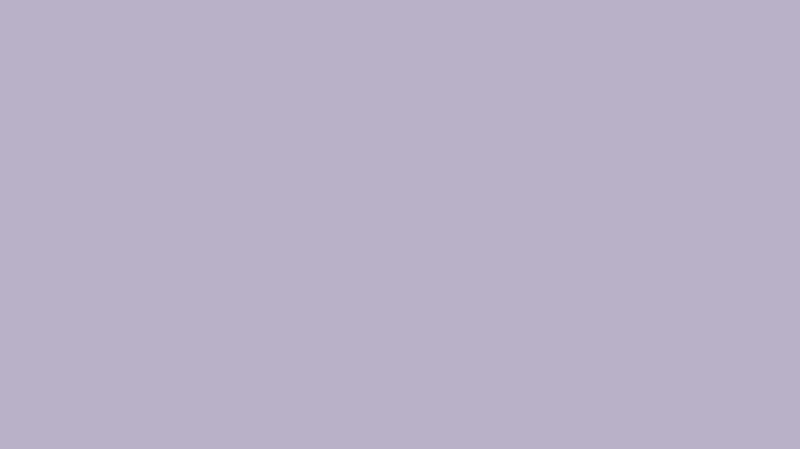
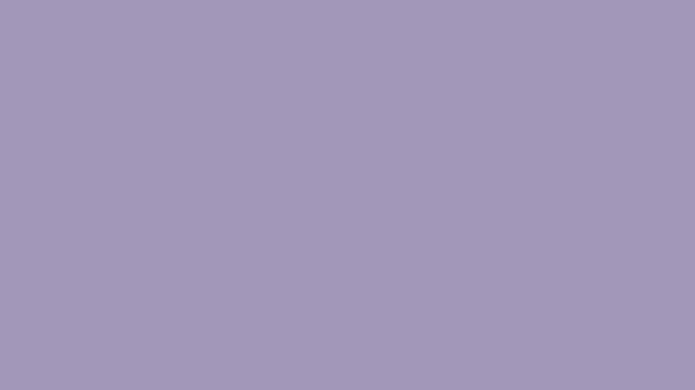

# ASEAN冷蔵庫 IoTアプリ

| 項目 | 内容 |
|---|---|
| ヒーローイメージ |  |
| タイトル | ASEAN冷蔵庫 IoTアプリ |
| 期間 | 2025.09 ~ 2026.06 |
| タグ | UIデザイン / IoT家電 / 海外向けUI |

## OVERVIEW

ASEANの冷蔵庫にはじめて搭載されるIoTアプリ「AIoT Refrigerator」のUIデザインを担当しました。価格を据え置いたままシェア獲得を狙う戦略の中、温度設定やモード変更といった基本機能を、迷わず直感的に操作できる体験として設計しました。

*アプリの主要画面をまとめた全体像（仮）*

## POINT OF VIEW

### 「自動で冷やす箱」から、"選べる"パートナーへ
冷蔵庫は設置したら終わりの、意識の外にある家電になりがちです。ASEAN向けIoTアプリでは、キンキンに冷えたビールを飲みたい、急速冷凍でおいしさを保ちたいといった暮らしの目的に応じて保存方法を"選べる"存在として、UIで冷蔵庫とユーザーとの関係性を再構築することを設計の軸に据えました。

*課題を示すビジュアル（仮）*

## DESIGN

### 機器の状態を理解し、思い通りに操作できるUIへ
温度設定やモード変更など、冷蔵庫本体でできる操作をアプリでも同じように行えるようにしました。Express freezingやExpress coolなど機能ごとに説明を添え、設定変更時はスナックバーで確定を伝えることで、迷わず安心して操作できるようにしました。

### 食材から、最適な保存方法へ迷わず
肉・魚・野菜・飲み物など保存したい食材を選ぶと、最適な保存モードと収納先をアプリが提案。該当ルームへ食材を入れるよう視覚的にガイドし、設定までをその場で完結させることで、専門的なモード名を意識せず保存方法にたどり着けるようにしました。

### 全体像
プレースホルダー — UX全体のボリューム感が伝わる全画面ビジュアルを配置予定。

## PROCESS

### 複雑な企画仕様を、整理し直す
企画側のMode change・Temperature controlフローはモードごとの分岐が多く、画面同士の情報レベル感もバラバラでタップ数の多い仕様でした。情報設計をFixさせるところから着手し、直感的な導線に整理し直しました。

### 海外6社をベンチマークし、立ち位置を把握
Toshiba・Samsung・Haier・Midea・LG・Panasonicなど海外の冷蔵庫アプリを比較調査。各社のUIの整理度合いや情報設計の水準を把握した上で、SHARPらしい体験の方向性を検討しました。

## 関連作品

- NEW COCORO HOME
- COCORO HOME AI
