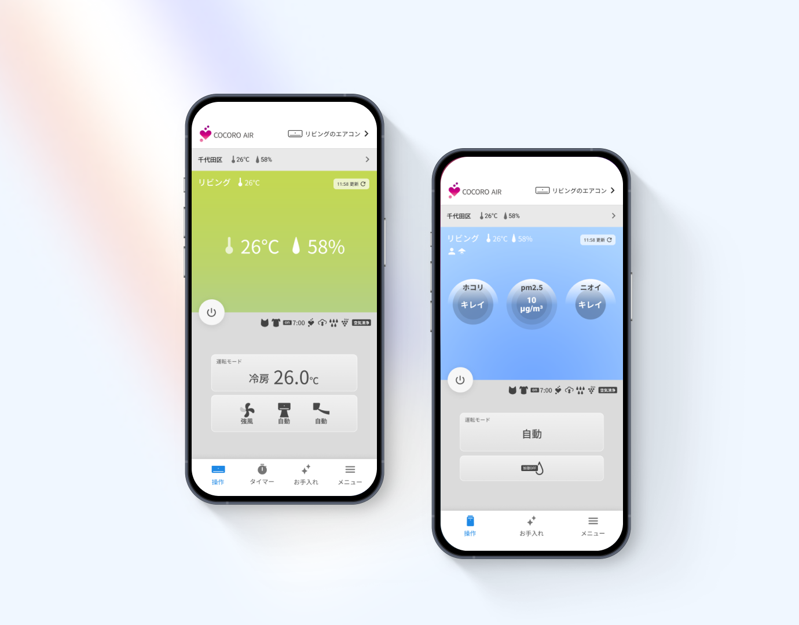
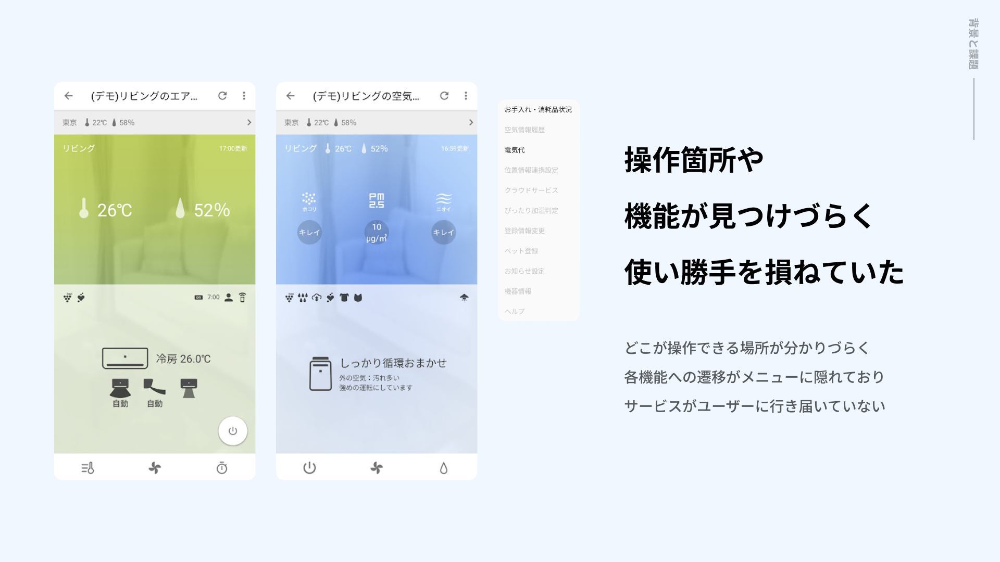
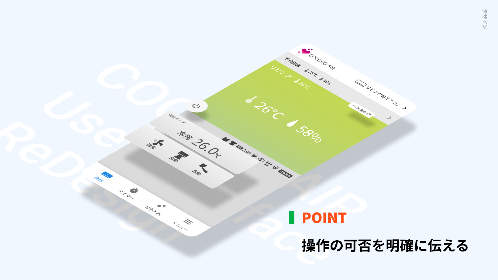
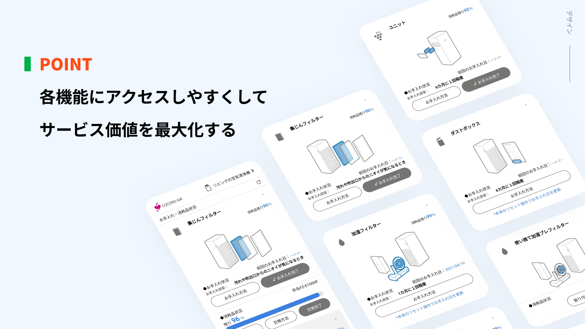

# COCORO AIR リデザイン

| 項目 | 内容 |
|---|---|
| ヒーローイメージ |  |
| タイトル | COCORO AIR リデザイン |
| 期間 | 2020.12 ~ 2021.05 |
| タグ | UIデザイン / リデザイン / IoT家電アプリ |

## OVERVIEW

エアコンや空気清浄機の遠隔操作、消耗度が確認できる「ココロエアー」をリデザイン。誤操作の多い表示部をボタン化し、機能が伝わるアイコンへ変更しました。

*アプリの主要画面をまとめた全体像（仮）*

## DESIGN

### 操作できる場所が、一目でわかる。
部屋の状態はカラー、機器操作はグレーで、情報の種類を色で区別。設定温度やモードの「表示箇所」と「操作箇所」が離れ、どこを操作できるか分かりづらかった状態を改善しました。

### 機能にアクセスしやすいUIへ。
ボトムナビを各機能へのナビゲーションに使い、機器操作以外の価値も前面化。お手入れ・消耗品状況へのリンクをボトムナビゲーションに配置し、様々な機能へのタッチポイントを提供しました。

### 全体像
プレースホルダー — UX全体のボリューム感が伝わる全画面ビジュアルを配置予定。

## PROCESS

### UTで検証し、全員が新デザインを支持。
改善案をユーザーテストにかけたところ、11人中11人が新デザインを支持。深い階層にあった機能も前面化し、迷わず操作できる状態を確認しました。

## OUTCOME

| 数値 | 説明文 |
|---|---|
| 11/11 | UTで全員が新デザインを支持 |
| 2層 | 状態と操作を色で分離 |
| 前面化 | 深い階層の機能を表に |

## 関連作品

※ 出典（Notion）に記載がないため、未記載。

参考リンク: [COCORO AIR](https://jp.sharp/aiot/air-aircon/) / [お手入れを習慣化させる情報設計とは？](https://design.sharp.co.jp/design_column/inside-design-stories-09)
