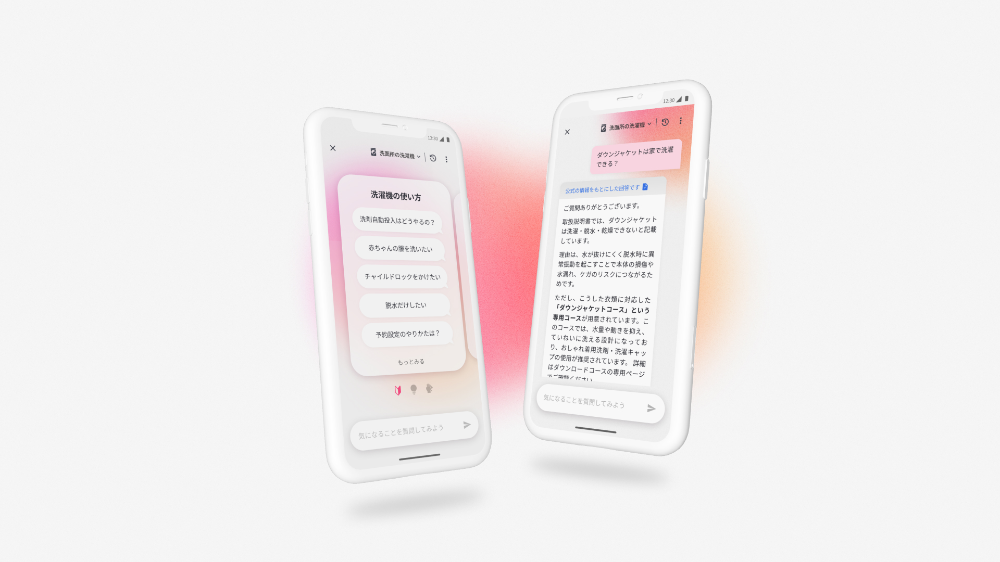
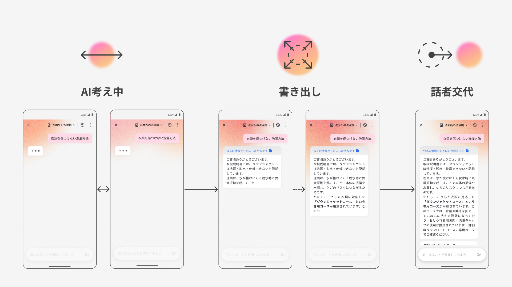
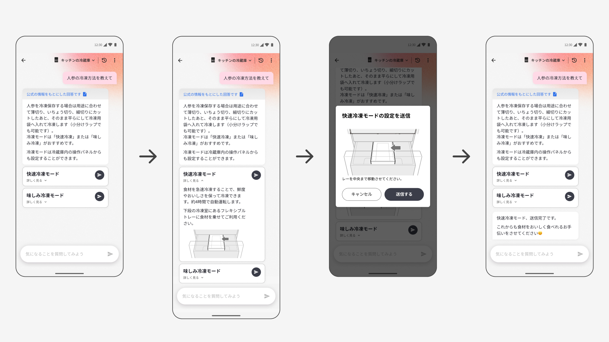
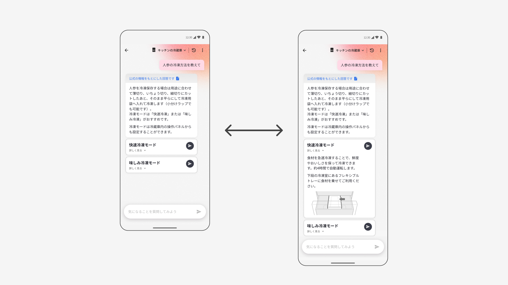

# COCORO HOME AI

| 項目 | 内容 |
|---|---|
| ヒーローイメージ |  |
| タイトル | COCORO HOME AI |
| 期間 | 2026.01 ~ 06 |
| タグ | UIデザイン / IoT家電アプリ / 生成AI |

## OVERVIEW

IoT家電アプリ「COCORO HOME」に、家電に関する悩みを生成AIで解決するアシスタント機能のUIをデザインしました。対応機種の取扱説明書やFAQを学習し、シャープの一次情報にもとづいて的確に回答。登録済みの家電型番を参照し、該当する取説ページも画像で提示することで、「調べて終わり」にしない体験を目指しました。

## DESIGN

### 質問サジェストで、AIとの会話を後押し。
家電の相談は故障やエラーなど「困ってから」に偏りがち。トップに質問事例を並べ「こんなことも聞ける」と気づける入り口にしました。事例は開くたびに変わり、一次情報にもとづく回答には「シャープ公式回答」バッジを添えて信頼感を持たせています。

### 背景アニメーションで、AIの知性と寄り添いを表現。
彩度の高いピンクとオレンジの円形グラデーションを、豊かな暮らしのイメージとして全画面に敷きました。思考中は横移動、書き出しは拡大縮小、話者交代は右への移動と、AIの状態を有機的な動きで伝え、画面全体で呼応する感覚を目指しました。

### 回答から、そのまま家電を操作できる。
食材の保存方法などの回答には、対応する冷凍モードの設定ボタンを表示。確認モーダルと送信完了フィードバックまで設計し、「調べる」で終わらず「操作する」までを会話の中で完結させました。

### アコーディオンで、初見の情報量をコントロール。
モードの詳細説明はアコーディオンに畳み、気になる人だけが開いて読める形に。会話画面の文章量をコンパクトに保ち、あとから会話を遡るときも追いやすくしました。

## PROCESS

### 「困ってから」だけでなく「もっと良く」も引き出す。
エラーやトラブルの「事後」だけでなく、上手に洗いたい・ふわふわに仕上げたいといった「事前」の前向きな相談も想定。幅広く家事について問い合わせられる関係性を、サジェストの切り口から設計しました。

### 「控えめ」ではなく「提案する」AIとして。
他社の対話AIがユーザーのやりたいこと優先の控えめな立ち位置なのに対し、COCORO HOME AIは「やれること」を積極的に訴求。家電を楽しく快適に使い続けてもらうことをゴールに、提案型のふるまいを軸に据えました。

## 関連作品

- NEW COCORO HOME
- COCORO AIR リデザイン
