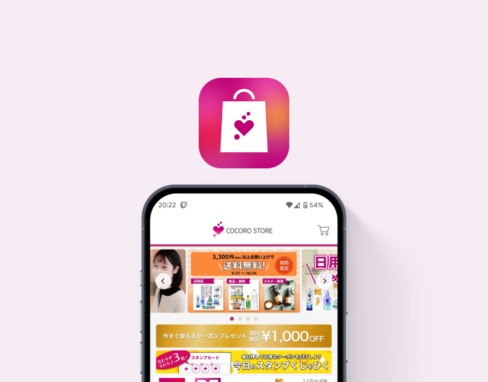
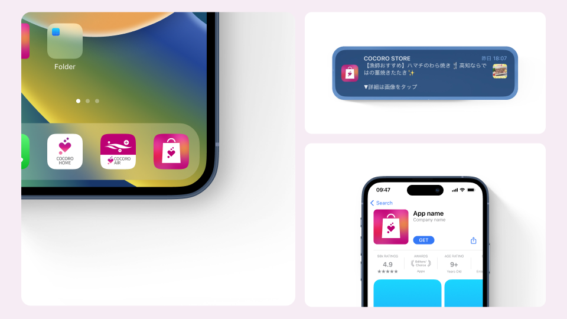
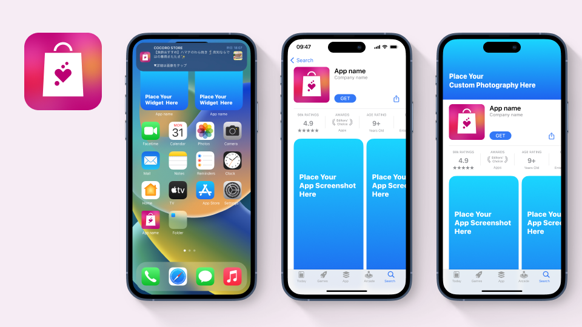
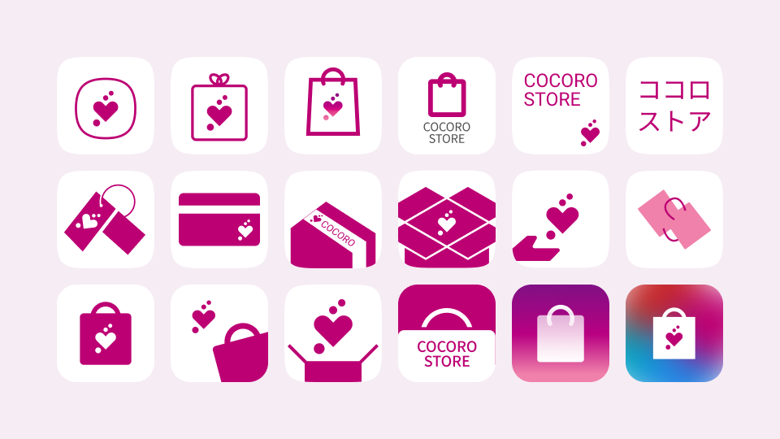

# COCORO STORE アイコンデザイン

| 項目 | 内容 |
|---|---|
| ヒーローイメージ |  |
| タイトル | COCORO STORE アイコンデザイン |
| 期間 | 2023.07 |
| タグ | グラフィックデザイン / アプリアイコン / ブランディング |

## OVERVIEW

シャープ公式ECサイト「COCORO STORE」のアプリアイコンをデザイン。フォーマット化されたココロサービスのアイコン群の中で、立ち位置の異なるCOCORO STOREが埋没しないアイコンを目指しました。

*アプリの主要画面をまとめた全体像（仮）*

## DESIGN

### エネルギッシュで、目を引くアイコンへ。
「健康にまつわる商品を拡充し、ご年配の健やかな生活に寄与したい」という担当者の想いと、40〜60代がメインユーザーであることから、エネルギッシュで目を引くアイコンを検討しました。

### 色とモチーフで、親しみやすさを演出。
最終案は、ココロピンクとビタミンカラーのグラデーションでエネルギッシュな印象を、気軽にお買い物できるイメージを踏襲したショッパーモチーフで表現しました。

### 全体像
プレースホルダー — UX全体のボリューム感が伝わる全画面ビジュアルを配置予定。

## PROCESS

### シルエットモチーフを軸に、方向性を模索。
他のココロアプリアイコンがシルエットモチーフであることから、COCORO STOREもこれをベースに検討。ECにまつわる要素を具象・抽象さまざまな方向からアイデア展開しました。

### 実機プレビューで、見え方を綿密に検証。
ストアやホーム画面での見え方を常にプレビューしながら、既存のアイコン群の中で違和感のないデザインになるよう綿密に検討を重ねました。

## OUTCOME

※ 出典（Notion）に成果指標の記載がないため、未記載。

## 関連作品

※ 出典（Notion）に記載がないため、未記載。

参考リンク: [COCORO STORE（Web）](https://cocorostore.jp.sharp/) / [COCORO STORE（Play Store）](https://play.google.com/store/apps/details?id=jp.co.sharp.android.cocorostoreapp)
