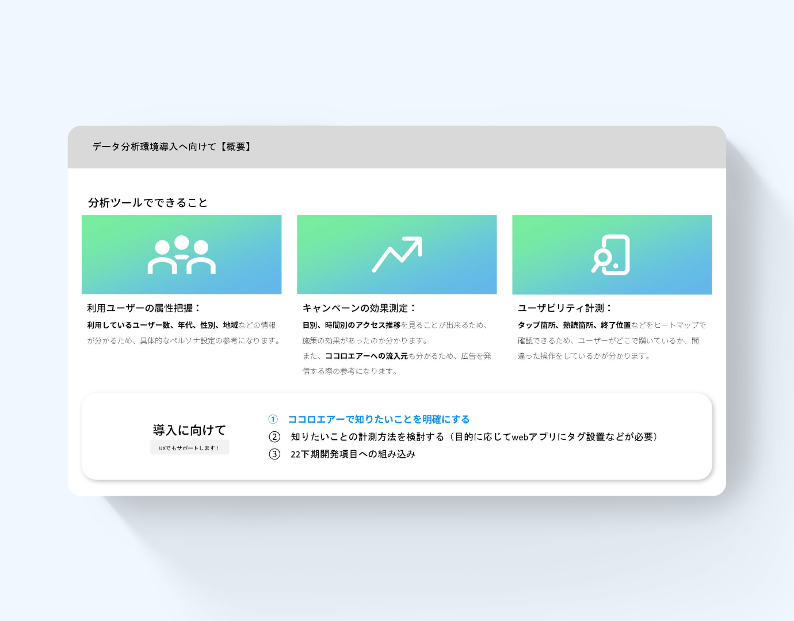
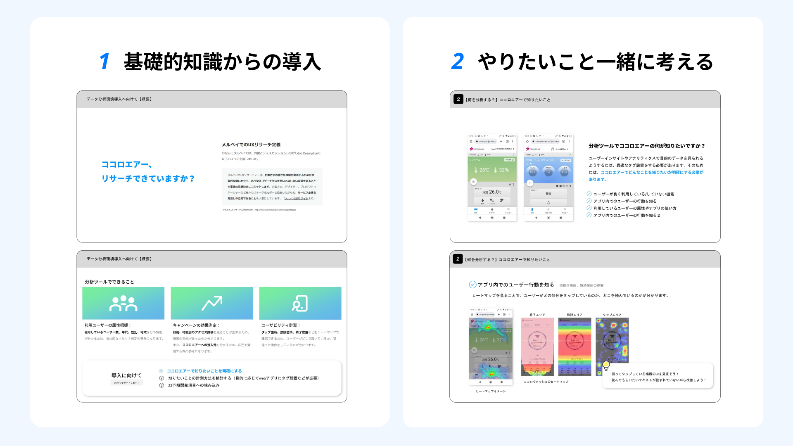
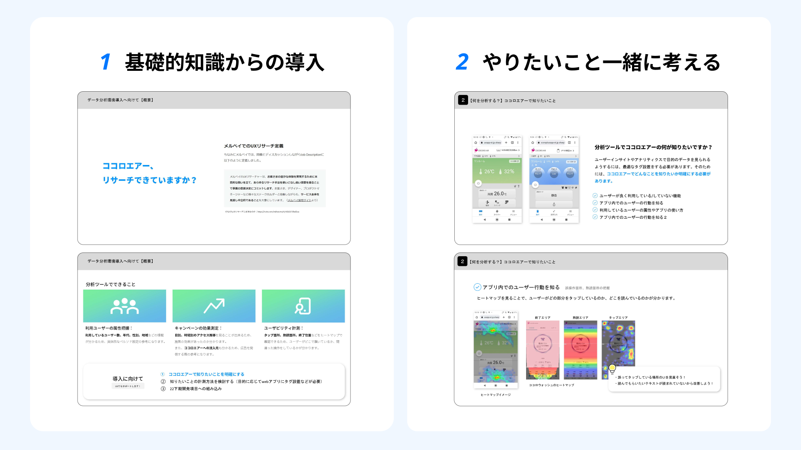

# データ分析ツール導入提案

| 項目 | 内容 |
|---|---|
| ヒーローイメージ |  |
| タイトル | データ分析ツール導入提案 |
| 期間 | 2022.05 ~ 10 |
| タグ | データ分析 / 導入提案 / Webアプリ |

## OVERVIEW

スマホWebアプリ「ココロエアー」へのデータ分析ツール導入を提案し、導入を実現。定性調査が中心だった開発に、データ分析による定量調査のアプローチを持ち込みました。

*アプリの主要画面をまとめた全体像（仮）*

## DESIGN

### 定性に、定量の視点を。
Google Analytics と User Insight を導入する提案をまとめ、事業部にプレゼン。データが語る事実を、デザイン判断の材料に加えられる状態を目指しました。

### リテラシーに寄り添い、丁寧に説明。
事業部にはデータ分析の経験がありませんでした。「初歩的な知識」「ツールでできること」「ココロエアーでできる分析」を、段階を踏んで説明しました。

### 全体像
プレースホルダー — UX全体のボリューム感が伝わる全画面ビジュアルを配置予定。

## PROCESS

※ 出典（Notion）にProcessの記載がないため、未記載。

## OUTCOME

| 数値 | 説明文 |
|---|---|
| 導入実現 | GA ＋ User Insight |
| 0→1 | 事業部の分析基盤を立ち上げ |
| +定量 | 定性中心の改善に視点を追加 |

## 関連作品

※ 出典（Notion）に記載がないため、未記載。
