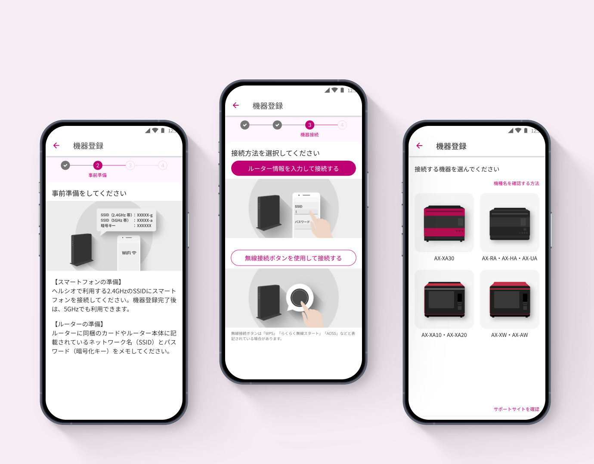
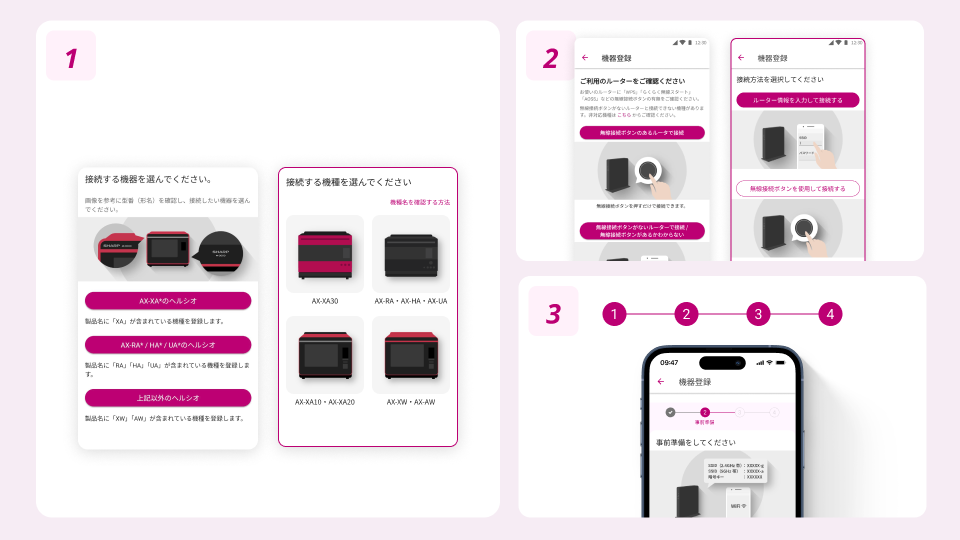
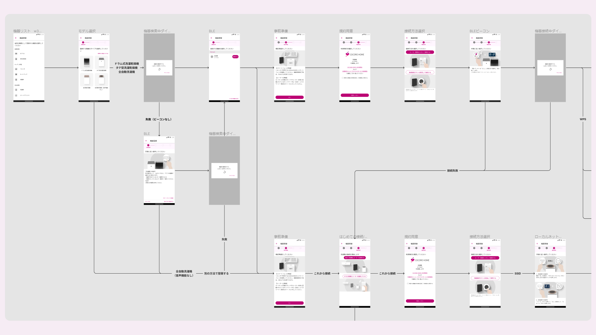

# 家電登録フロー改善

| 項目 | 内容 |
|---|---|
| ヒーローイメージ |  |
| タイトル | 家電登録フロー改善 |
| 期間 | 2022.10 ~ 2023.03 |
| タグ | UIデザイン / UXフロー改善 / IoT家電アプリ |

## OVERVIEW

ココロホームの機器登録UIを、一目で操作が分かるフローへ改善。利用頻度が少ないUIだからこそ、直感的に分かるデザインを目指しました。

*アプリの主要画面をまとめた全体像（仮）*

## DESIGN

### 迷わず進める、登録フローへ。
テキストボタンからカードUIに変更し、画像で視覚的に説明。従来はテキスト説明が中心で視覚的な強弱がなく、直感的に操作が分かりませんでした。

### 全体像
プレースホルダー — UX全体のボリューム感が伝わる全画面ビジュアルを配置予定。

## PROCESS

### 100超の遷移を可視化して整理。
家電のジャンルやモデルで分岐する100超の画面遷移をFigmaで可視化。説明文やボタン文言も見直し、最小限の言葉で伝わる設計に整理しました。

## OUTCOME

| 数値 | 説明文 |
|---|---|
| 100+ | 可視化した画面遷移 |
| カードUI | テキスト説明から置換 |
| 最小限 | 説明文・ボタン文言を削減 |

## 関連作品

※ 出典（Notion）に記載がないため、未記載。
