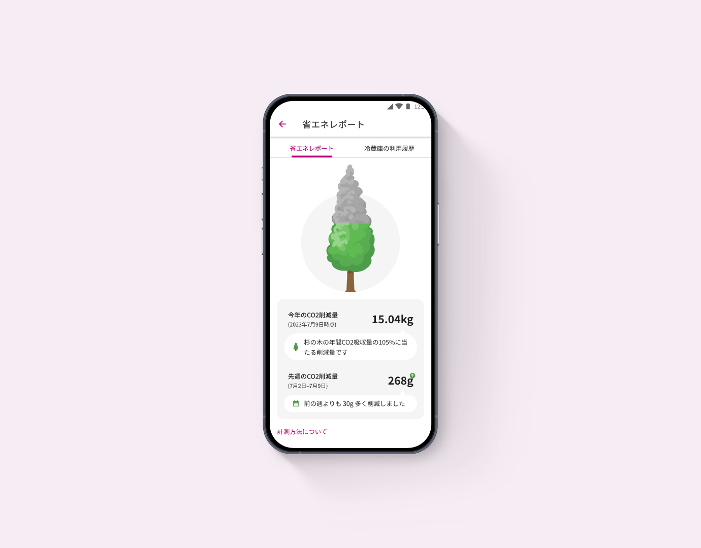
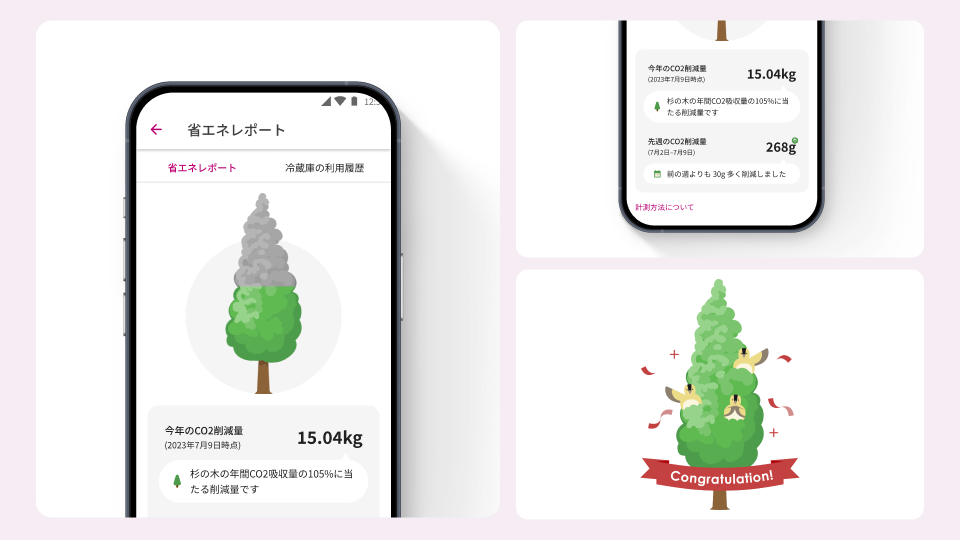
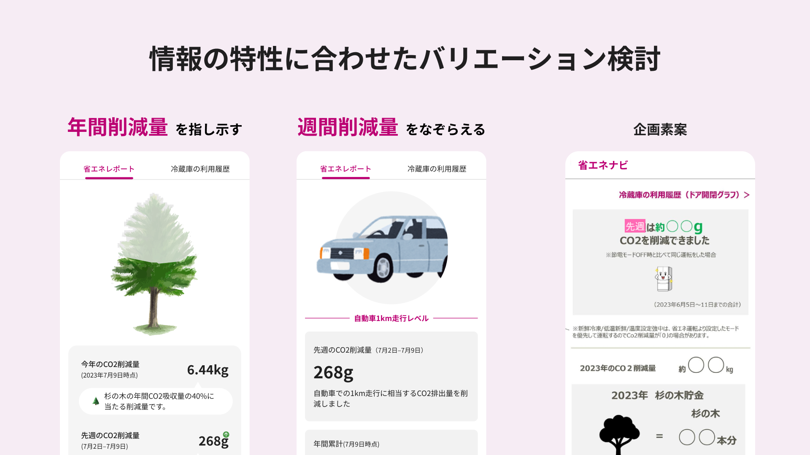

# 省エネレポート

| 項目 | 内容 |
|---|---|
| ヒーローイメージ |  |
| タイトル | 省エネレポート |
| 期間 | 2023.07 ~ 08 |
| タグ | UIデザイン / IoT家電アプリ / データ可視化 |

## OVERVIEW

冷蔵庫の省エネ運転による削減CO2量を可視化する「省エネレポート」のUIをデザイン。年間削減量14kg（杉の木1本の年間CO2吸収量）を100%とした杉の木インジケーターで、分かりづらい削減量を直感的に伝えます。

*アプリの主要画面をまとめた全体像（仮）*

## DESIGN

### 杉の木インジケーターで、削減量を直感的に。
杉の木1本の年間CO2吸収量を指標としたメーターでCO2削減量を表現。一目で成果が分かり、興味を持てる画面を目指し、イメージしづらい削減量を分かりやすく伝えています。

### 小さなご褒美で、続けたくなる仕掛けに。
年間14kg以上のCO2を削減すると小鳥がお祝いしてくれる隠し要素を用意。少しずつ色づいていく杉の木をチェックする楽しさと、達成感を演出しました。

### 全体像
プレースホルダー — UX全体のボリューム感が伝わる全画面ビジュアルを配置予定。

## PROCESS

### 積み上げ型の数値表示から、意図ある体験へ。
初期仕様は週間・年間のCO2削減量とイラストを積み上げただけで、何をすべきか分からない画面でした。省エネ成果を見せたいという企画意図を汲み、プロトタイピングと並行してコンセプトを明確化しました。

### 振り切った提案で、コンセプトを言語化。
年間ベース・週間ベースそれぞれに振り切った案を提案したところ「年間を見せたい」と回答を得て、「年間のCO2削減量を提示し、削減量を実感させる」とコンセプトを明文化し最終調整しました。

## OUTCOME

※ 出典（Notion）に成果指標の記載がないため、未記載。

## 関連作品

※ 出典（Notion）に記載がないため、未記載。
