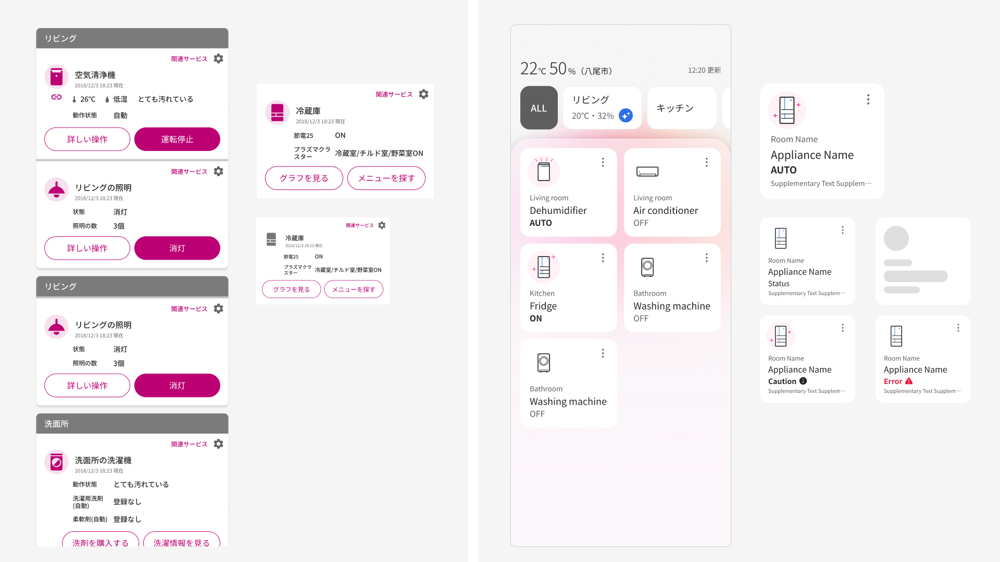
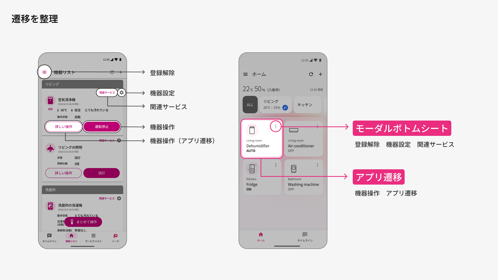
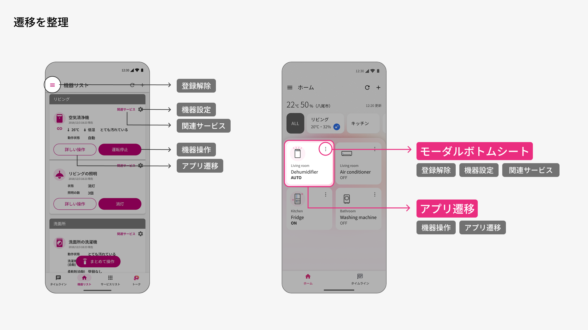
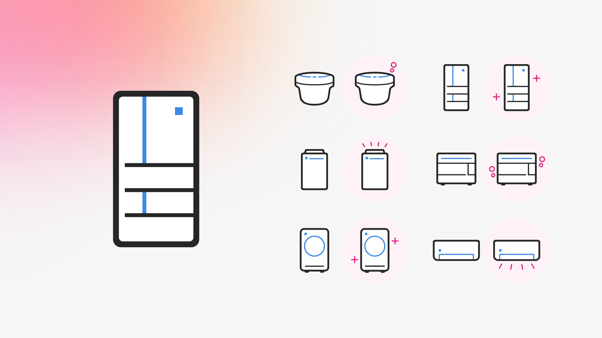

# NEW COCORO HOME

| 項目 | 内容 |
|---|---|
| ヒーローイメージ |  |
| タイトル | NEW COCORO HOME |
| 期間 | 2025.10 ~ 2026.03 |
| タグ | UIデザイン / IoT家電アプリ / 情報設計 |

## OVERVIEW

IoT家電アプリ「COCORO HOME」の主要機能を統合した新しい「トップ画面」のUIをデザインしました。リリースから歳月を重ねることで累積した多様な機能とサービスを整理し、再び使いやすいUIにリデザインしました。

*アプリの主要画面をまとめた全体像（仮）*

## POINT OF VIEW

### 増え続ける家電を、迷わず選べる土台へ
本プロジェクトは、機器リストのUI改善からスタートしました。将来的なMatter対応で接続台数の増加が見込まれる中、個々の機能を足すのではなく、情報量と配色のルールを揃えて一覧性を取り戻し、台数が増えても破綻しない「増えても選びやすい」トップ画面を核に据えることを出発点としました。

*課題を示すビジュアル（仮）*

## DESIGN

### 機器ごとの情報量を揃え、一覧性を取り戻す
家電ごとにバラバラだった表示項目を、部屋名・機器名・状態に統一。削った詳細情報はモーダルやボトムシート、遷移先のサービス側に割り切って預けました。カードは「選ぶ」ことに専念させ、台数が増えて積み上がっても崩れない一覧性を確保しています。

### 散らばっていた操作の入口を、ひとつに集約
関連サービスの設定や詳しい操作は、カードごとに複数のボタンやアイコンから別々のダイアログ・ページに散らばっていました。これらを1つのメニューアイコンに集約し、開いた先はボトムシートかアプリ遷移のどちらかに統一。操作の入口をひとつに揃えました。

### ココロピンクの使いどころを、絞り込む
視覚的な優先度が高いポイントにだけ、ココロピンクの使いどころを限定。彩度と明度を上げて重たかった印象を軽やかに改善し、警告色に見えてしまう印象も払拭しました。

### 記号のアイコンにも、愛着を
全体のデザインテイストに合わせ、抜け感のある軽やかなイラストへ刷新。差し色を加えて記号としてのアイコンにも愛着が持てるようにし、電源ON時は要素を足して家電がユーザーに働きかける楽しさを演出しました。

### 全体像
プレースホルダー — UX全体のボリューム感が伝わる全画面ビジュアルを配置予定。

## 関連作品

※ COCORO HOME AI