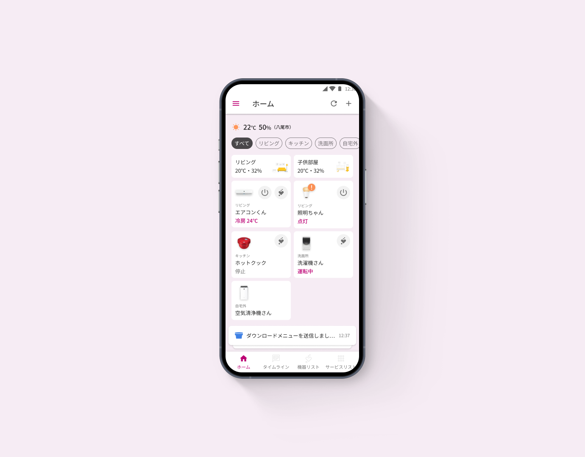
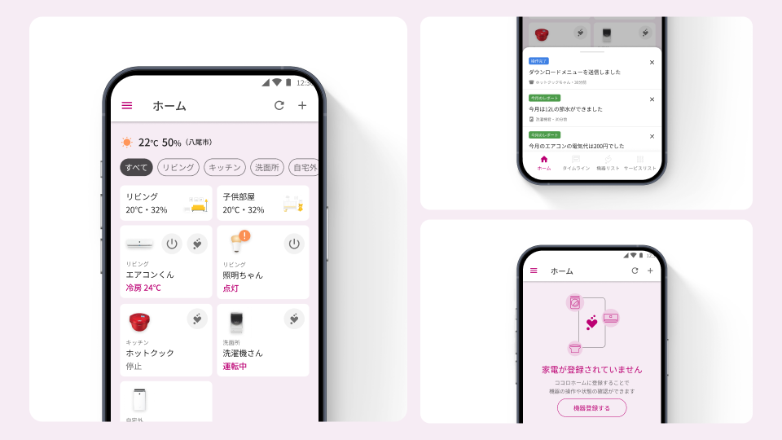
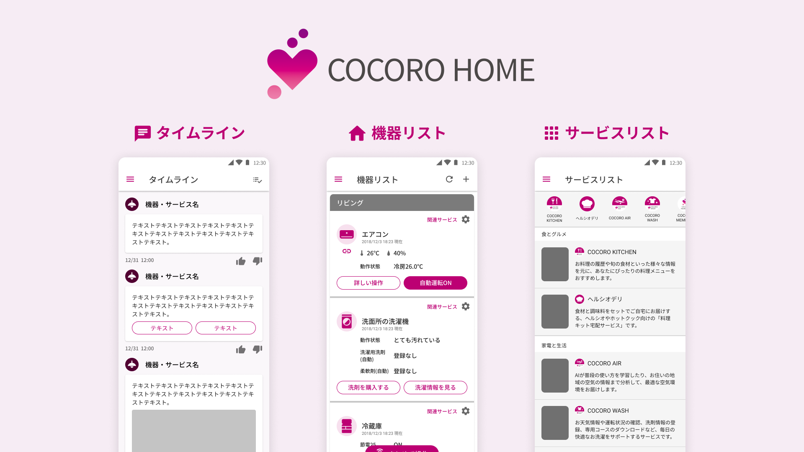

# NEW COCORO HOME

| 項目 | 内容 |
|---|---|
| ヒーローイメージ |  |
| タイトル | NEW COCORO HOME |
| 期間 | 2022.10 ~ 2023.03 |
| タグ | UIデザイン / IoT家電アプリ / 情報設計 |

## OVERVIEW

IoT家電アプリ「ココロホーム」の主要機能を統合した新しい「トップ画面」のUIをデザイン。多様な機能とサービスが入り乱れたカオス状態を、タイムライン・機器リスト・サービスリストの統合で解消しました。

## DESIGN

### 家電カードUIを再設計し、選びやすく。
入り乱れた機能をTOP画面に再レイアウトし、家電のカードUIをリデザイン。ユーザーがぱっと見で操作したい家電を選べ、より素早く積極的に利用できるカタチを提案しました。

### 必要な情報が、埋もれない通知設計へ。
タイムライン画面から家電のお知らせだけをフィルタリングした通知バーをレイアウト。家電ごとにバラバラだった情報量を統一し、必要な情報が埋もれないようにしました。

### 家電未登録の状態にも、ワクワク感を。
家電が未登録の状態も無機質にせず、つないだ後の期待感が伝わるイラストを配置。使い始める前からポジティブな体験を演出しました。

## PROCESS

※ 出典（Notion）にプロセスの記載がないため、未記載。

## OUTCOME

※ 出典（Notion）に成果指標の記載がないため、未記載。

## 関連作品

※ 出典（Notion）に記載がないため、未記載。
