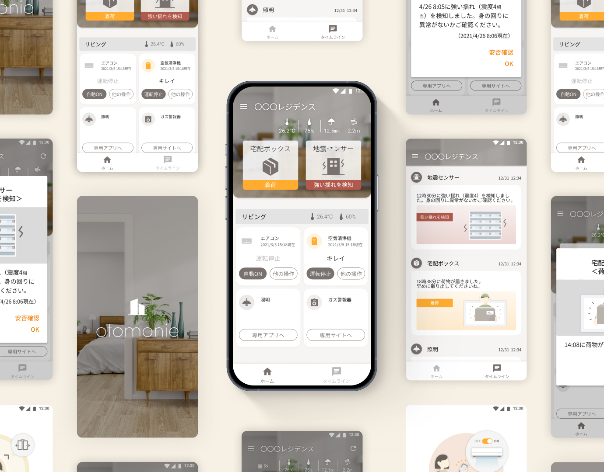
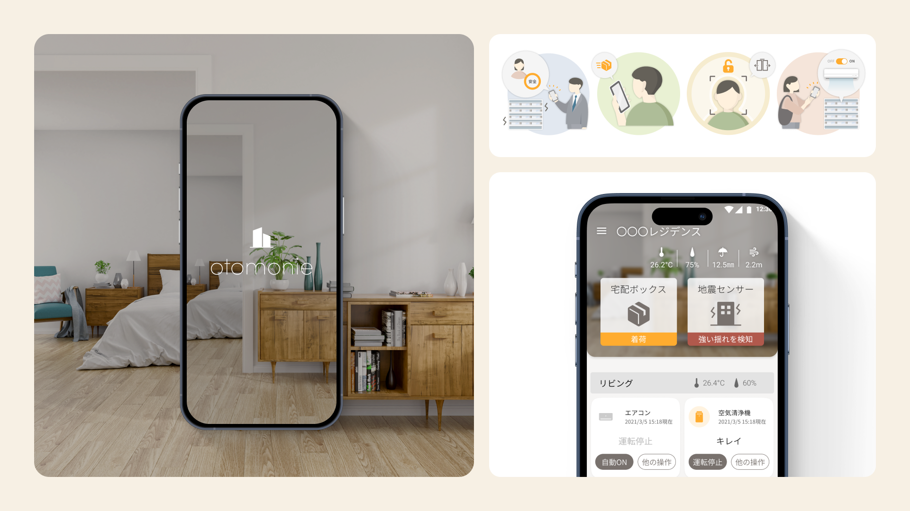
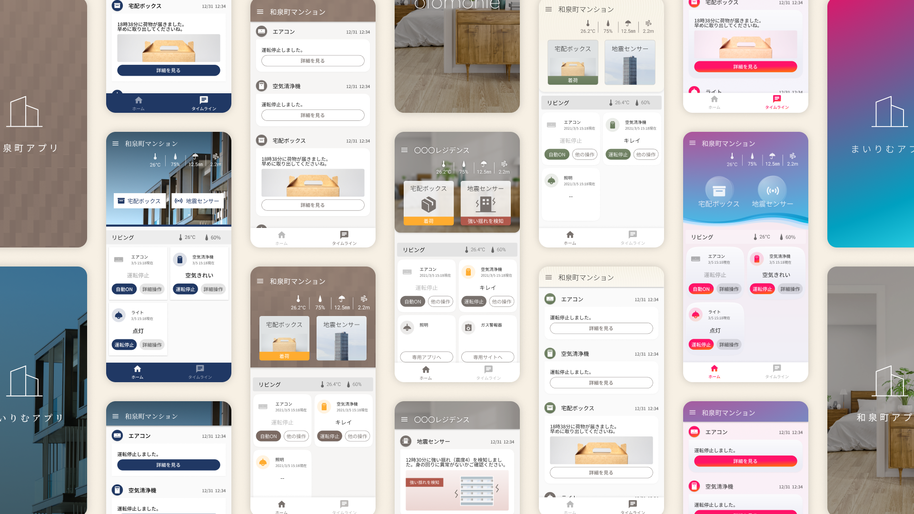
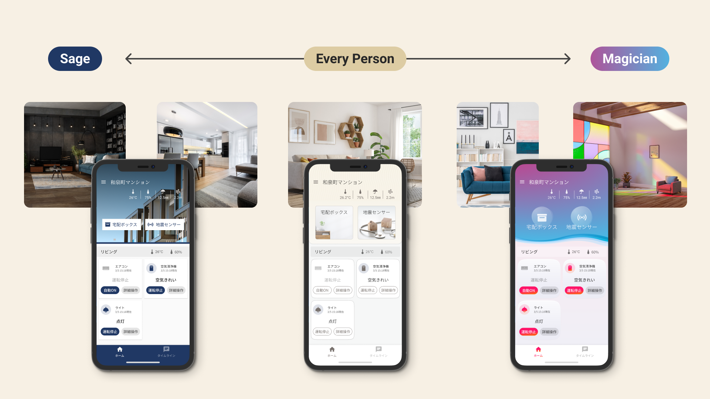
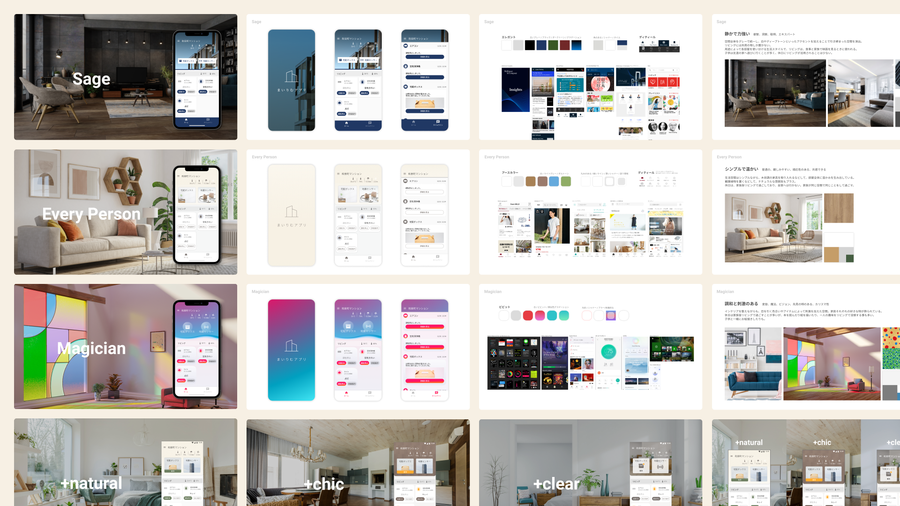

# otomonie UIディレクション

| 項目 | 内容 |
|---|---|
| ヒーローイメージ |  |
| タイトル | otomonie UIディレクション |
| 期間 | 2021.06 ~ 08 |
| タグ | UIディレクション / IoT家電アプリ / 提案 |

## OVERVIEW

長谷工株式会社様のマンション専用IoTアプリ「otomonie」のUIデザインのディレクションとクライアントコミュニケーションを担当しました。
otomonieは、自宅の家電の遠隔操作や、宅配ボックスの荷物確認、マンションからのお知らせ確認など、暮らしに寄り添う機能を備えたアプリです。
デザインメンバーが参画したタイミングでは、アプリのデザインイメージが明確に描けていませんでした。デザインテイストを幅広く提案してクライアントと一緒に絞り込んでいくことで、納得感のあるデザインに決定することができました。

*アプリの主要画面をまとめた全体像（仮）*

## DESIGN

### 第二の居住空間のような、あたたかいアプリ
単身者からファミリーまで幅広いユーザーを想定し、「第二の居住空間」のようなアプリをデザインしました。透明感ある実写の室内イメージで、シンプルながら温かみのある印象を目指しました。

### 部屋のモノ感を、大きなアイコンで表現。
豊富なイラストと「部屋のモノ感」のある大きなアイコンボタンを採用。プライマリーカラーのオレンジで、暮らしに陽気なイメージをプラスしました。

### 全体像
プレースホルダー — UX全体のボリューム感が伝わる全画面ビジュアルを配置予定。

## PROCESS

### 中立案を軸に、振れ幅のある提案を。
H社へのOEM製品開発として進行したこのプロジェクトでは、クライアントの中でアプリのデザインイメージが明確に固まっていないという課題がありました。そこで中立な案を軸に、シックな案とユニークな案へ振り切って提案し、2回にわたり計6案を提示しました。

### 居住空間のイメージごと、選べるように。
アプリと共に居住空間のイメージも膨らませ、マンションのビジョンに最も合う案を選べるように工夫。クライアントと一緒に絞り込み、納得感のあるデザインへ収束させました。

## OUTCOME

| 数値 | 説明文 |
|---|---|
| 6案 | 2回にわたり幅広いデザインを提示 |
| 合意形成 | 中立〜振り切った案で意見を引き出す |
| リリース済み | otomonieとして提供中 |

## 関連作品

※ 出典（Notion）に記載がないため、未記載。

参考リンク: [otomonie（App Store）](https://apps.apple.com/jp/app/otomonie/id1584587347)
